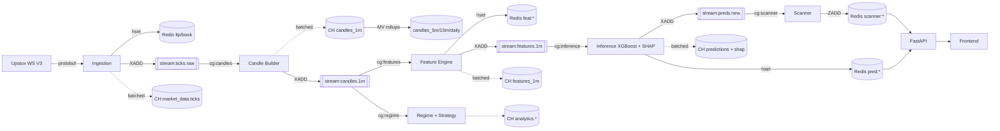
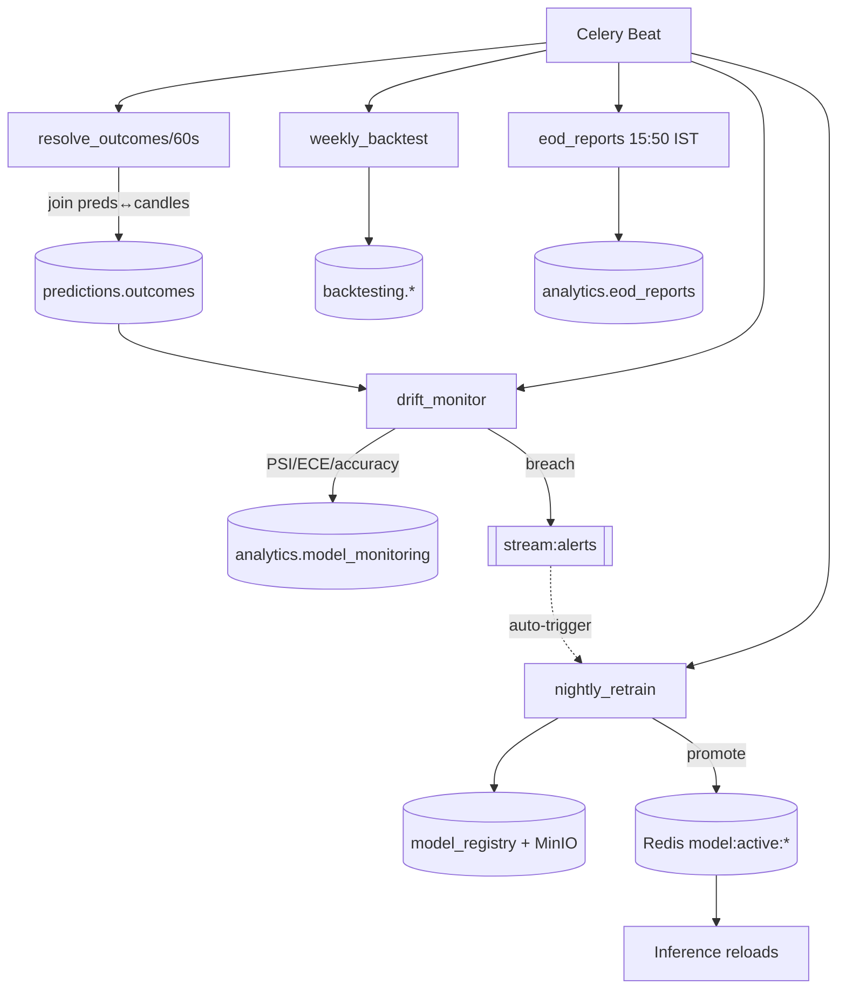
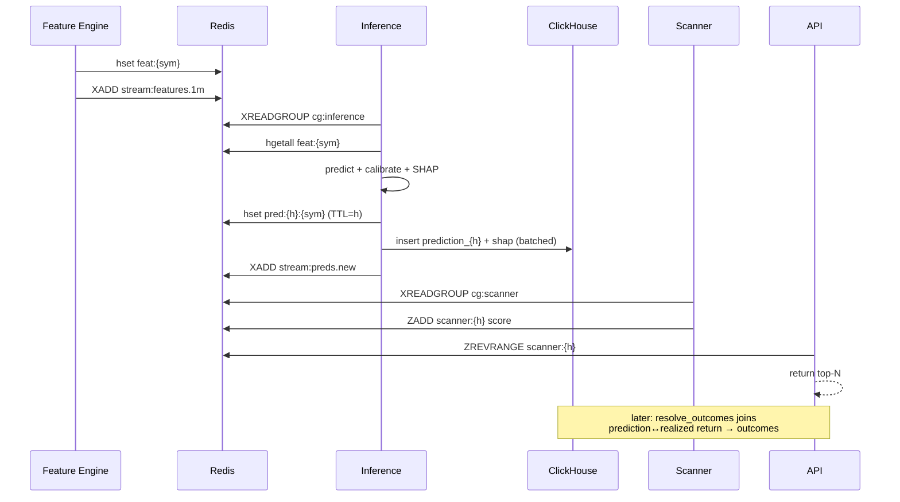
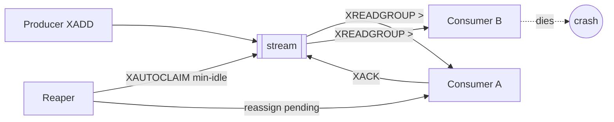

# Event-driven workflow diagrams

## 1. Real-time pipeline (tick → scanner)

Solid = hot path (Redis/streams, sub-second). Dotted = async batched writes to
ClickHouse (durable, off the latency-critical path).

## 2. Batch clock (Celery beat)

## 3. Prediction lifecycle (sequence)

## 4. Crash recovery (consumer groups)

At-least-once delivery: a message stays pending until `XACK`. If a consumer dies,
the reaper's `XAUTOCLAIM` reassigns its pending messages so nothing is lost.
